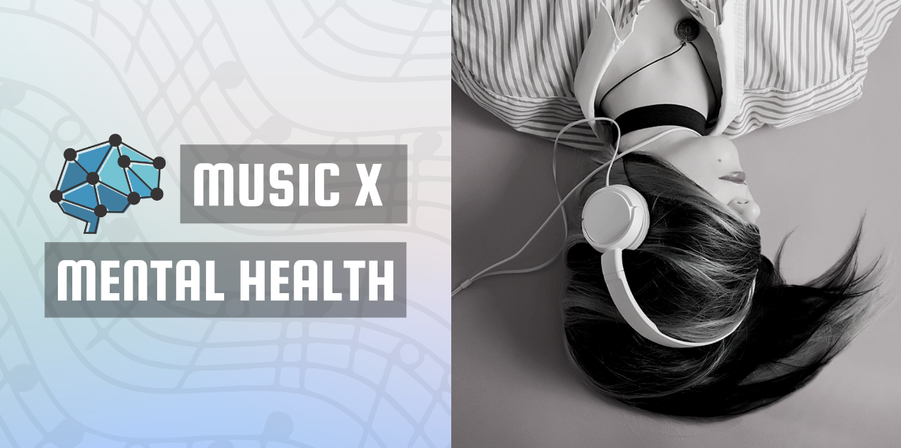

# Music-Mental-Health

Source  of the dataset: https://www.kaggle.com/datasets/catherinerasgaitis/mxmh-survey-results

Tableau Dashboard: https://public.tableau.com/app/profile/richton/viz/MusicandMentalHealthKPIs/Dashboard3

## Context
The objective of this project is to gain insights into the potential benefits of music therapy for individuals with depression by exploring the types of music genres preferred by people experiencing depression. The project aims to identify the most common music genres preferred by people with depression, explore whether certain genres are more effective in reducing symptoms, and understand the relationship between music and mood in individuals with depression.

## Conlusion
Based on the findings presented, it appears that music can have a positive impact on mental health, particularly for individuals with depression.

Individuals who listened to music for shorter periods of time, between 0-4 hours per day, tended to have lower average depression scores than those who listened for longer periods of time. Additionally, as people age, their average depression tends to decrease, which could be due to various factors such as experience, coping mechanisms, and changes in lifestyle.

In terms of music tempo, the moderate and slow tempo ranges had slightly lower average depression scores compared to the fast and very fast tempo ranges. While there is a small difference in average depression score for people who explore different genres and those who listen to foreign language music, it is unclear if this difference is statistically significant.

The study found that Gospel had a consistently positive impact on mental health, while Lofi had the highest average depression score. Video game had a negative effect on mental health, with a score of 9.30% on the scale of 100%, while Latin music showed mixed results. However, overall, all genres were found to have a positive effect on mental health, with a minimum positive effect of 50% on favorite genres and 69.83% on frequently listened to genres.

***NOTE: It is important to note that these findings are limited by the specific sample used in the study and may not be representative of the entire population. Further research is necessary to confirm these findings and to explore mechanisms through which music theraphy may be effective for individuals with depression.***

---
*This study was created as part of a course in Coursera called Data Visualization with Tableau Project, where the participant was required to submit a project.*
